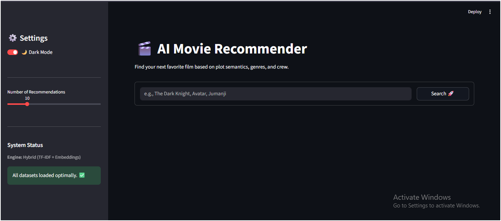
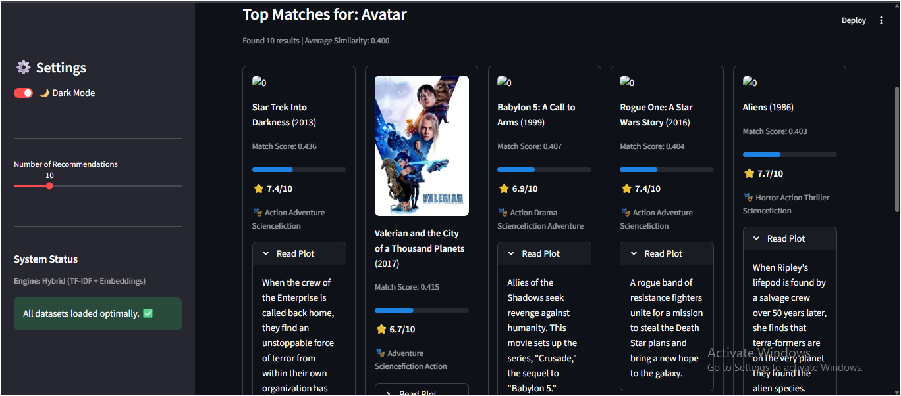
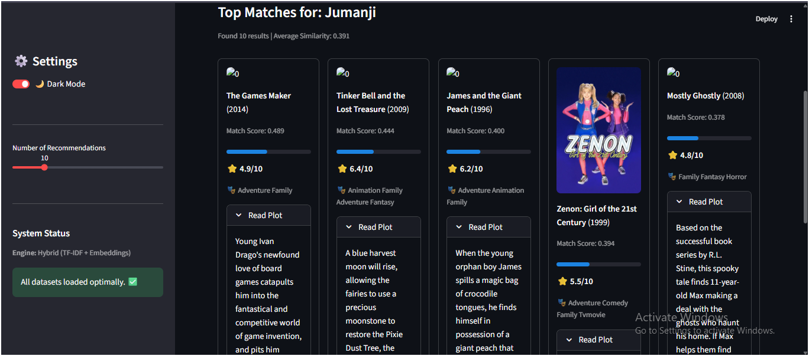

# 🎬 AI Movie Recommender System

A **hybrid movie recommendation system** that suggests similar movies using TF-IDF, Sentence Embeddings, and Cosine Similarity, enhanced with popularity-based ranking and a Streamlit web interface.

---

## 🌐 Live Demo

🚀 **Deployed App:**  
https://movierecommendations14.streamlit.app/

---

## 📸 Project Preview

Add your screenshots in an `images/` folder and update paths below:

### 🖥️ Home Page


### 🔍 Recommendations


### 🔍 Recommendations


---

## ✨ Features

- Hybrid recommendation system (TF-IDF + Embeddings)
- Semantic similarity understanding
- Cosine similarity-based ranking
- Popularity + rating boosting
- Streamlit interactive UI

---

## 🧠 How It Works

1. Data preprocessing (title, genres, keywords, cast, overview)
2. Feature extraction using TF-IDF + embeddings
3. Cosine similarity computation
4. Hybrid ranking system
5. Top-N movie recommendations

---

## 🏗️ Tech Stack

- Python
- Pandas / NumPy
- Scikit-learn
- TF-IDF Vectorizer
- Sentence Transformers (optional)
- Streamlit

---

## 📁 Project Structure

movie-recommender/
│
├── app.py
├── main.py
├── requirements.txt
├── README.md
│
├── data/
│ ├── df.pkl
│ ├── tfidf.pkl
│ ├── tfidf_matrix.pkl
│ ├── indices.pkl
│ └── embeddings.pkl
│
└── images/
├── home_page.png
├── recommendations1.png
└── recommendations2.png

---

## 🚀 Run Locally

```bash
pip install -r requirements.txt
streamlit run app.py
```

---

## 📊 Example Output

Input:
Avatar

Output:
- Star Trek Into Darkness
- Rogue One: A Star Wars Story
- Aliens
- Valerian and the City of a Thousand Planets

## 👨‍💻 Author

Sunny
